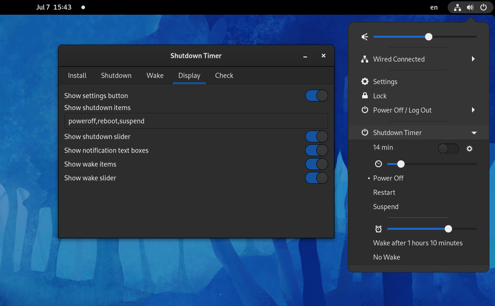
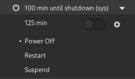
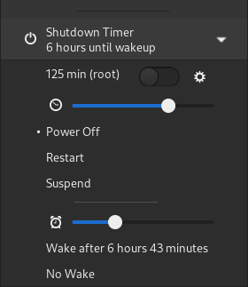

<h1 align="center">Shutdown Timer for Gnome Shell</h1>
<p align="center">
  
  <a href="https://extensions.gnome.org/extension/4372/shutdowntimer/">
    
  </a>
  <br/>
  <b>Shutdown/reboot/suspend your device after a specific time or wake with a rtc alarm.</b>
</p>



## Features
- Timer for *Poweroff*, *Reboot*, *Suspend* 
  - Options may be reordered or hidden
  - Disabling the extension leaves a timer process alive if the user was inactive for more than a second 
  - Note: `org.gnome.Mutter.IdleMonitor.GetIdletime > 1000` is expected when the screen saver disables the extension

- Show scheduled shutdown info as *(sys)*
  - Fetched from `/run/systemd/shutdown/scheduled` 
  - Externally run `shutdown 100` displayed in menu: <br/>
  - Displays the more urgent (external or interal) timer 

- Install privileged control script: `shutdowntimerctl`
  - Control `rtcwake` and `shutdown` as user
  - Support for `rpm-ostree` installation

- Wake alarm
  - Set a real-time-clock (rtc) alarm which wakes the system after shutdown
  - Wake info from: `/sys/class/rtc/rtc0/wakealarm`
  - Wake info displayed in menu: <br/>
  - Controlling wake alarm requires installation of privileged script
  - Note: for advanced use-cases there are more suitable tools: e.g. [gnome-schedule](https://gitlab.gnome.org/GNOME/gnome-schedule)

- Root shutdown protection
  - Toggle `shutdown ${REQUESTED_MINUTES + 1}` command with shutdown timer (for *Poweroff* and *Reboot*)
  - Protection against gnome-shell terminating, e.g. when logging out
  - If privileged script is not installed, `shutdown` command is run as user

- Check command
  - Runs a shell command and will only continue shutdown if command succeeds
  - Check command may be canceled

## Manual Installation

Requires `gnome-shell-extensions` and `gtk4-builder-tool`:
```(shell)
./scripts/build.sh -i
```
Then a new login is required to restart gnome-shell.

### Tool installation
Requires root:
```(shell)
sudo ./tool/installer.sh --tool-suffix $USER install
```
If available, also supports `rpm-ostree` installation.

## Development
### Debug
Install on a Xorg virtual/remote host for debugging:
```(shell)
./scripts/install_on_guest.sh
```
Install locally with debug output enabled:
```(shell)
./scripts/build.sh -d -i
```

### Update Translation Template
Extract text from source to translation template file `po/main.pot`:
```(shell)
./scripts/update-pod.sh
```

### Resources
- https://gjs.guide/extensions/
- https://gjs.guide/guides/
- https://gjs-docs.gnome.org/
