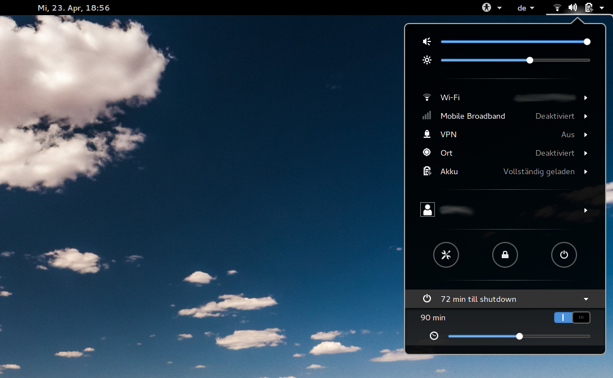

 
# Shutdown Timer

Shutdown/reboot/suspend your device after a specific time. Disabling the extension will not terminate the timer. This allows the timer to run uninterrupted during an active screen saver. This extension adds a submenu to the status area. 



## Features
- Poweroff, Reboot, Suspend (options can be reordered and disabled)
- Show scheduled shutdown info as *(sys)* (fetched from `/run/systemd/shutdown/scheduled`)
  - Externally run `shutdown 100` displayed in menu: 
  - Displays the more urgent (external or interal) timer 

- Wake
  - Set a real-time-clock (rtc) alarm which wakes the system after shutdown
  - Wake info displayed in menu: 
  - Requires root priviliges (password prompt with `pkexec`)
  - Note: for advanced use-cases there are more suitable tools: e.g. [gnome-schedule](https://gitlab.gnome.org/GNOME/gnome-schedule)

- Root mode protection (this *may* trigger a password prompt with `pkexec`)
  - Protection against gnome-shell failing by scheduling `shutdown ${REQUESTED_MINUTES + 1}`
  - Only requires root password once if at all

- Check command
  - Runs a shell command and will only continue shutdown if command succeeds
  - Check command can be canceled

## Official Installation

Visit [https://extensions.gnome.org/extension/4372/shutdowntimer/](https://extensions.gnome.org/extension/4372/shutdowntimer/) and follow browser extension install instructions.


## Manual Installation

Requires `gnome-shell-extensions` and `gtk4-builder-tool`:
```(shell)
./scripts/build.sh -i
```
Then a new login is required.

### For GNOME 40+
Install `org.gnome.Extensions` via flatpak
```
$ flatpak remote-add --if-not-exists flathub https://flathub.org/repo/flathub.flatpakrepo
$ flatpak install flathub org.gnome.Extensions
```

Open GNOME shell extension tool
```
$ flatpak run org.gnome.Extensions
```

## Development

### Restart GNOME-Shell (Xorg only)
Press `ALT+F2`, type `r` and press `Enter`

### Start nested GNOME-Shell (Wayland)
`dbus-run-session -- gnome-shell --nested --wayland`

### See Errors and Logs
* Press `ALT+F2`, type `lg` and press `Enter`
* Run `journalctl -f` in terminal

