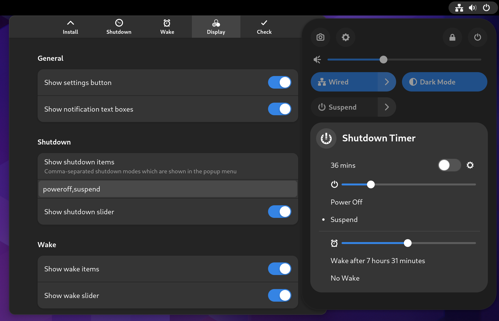
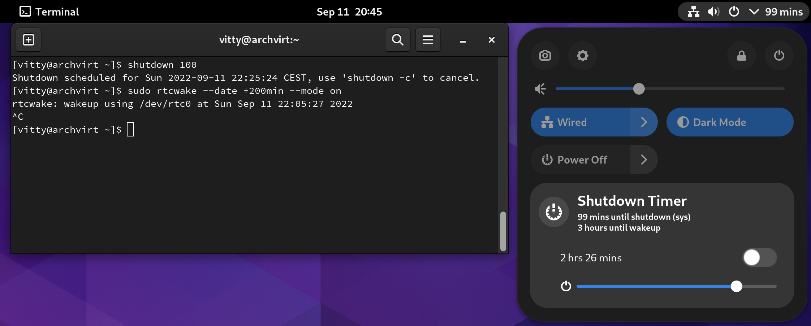

<!--
SPDX-FileCopyrightText: 2023 Deminder <tremminder@gmail.com>
SPDX-License-Identifier: GPL-3.0-or-later
-->

<h1 align="center">Shutdown Timer for Gnome Shell</h1>
<p align="center">
  
  <a href="https://extensions.gnome.org/extension/4372/shutdowntimer/">
    </img>
  </a>
  <a href="https://github.com/Deminder/ShutdownTimer/actions/workflows/build.yml"></img></a>
  <br/>
  <b>Shutdown/reboot/suspend your device after a specific time or wake with a rtc alarm.</b> 
</p>



## Features
- Timer for _Poweroff_, _Reboot_, _Suspend_
- Show system wake and shutdown schedules

- Unlock-dialog does *not* interrupt the timer
- Control `rtcwake` and `shutdown` as user by installing a privileged control script `shutdowntimerctl` from the extension settings window
- Option to run a *checking* shell command to confirm shutdown
- Option for ensuring system shutdown with additional `shutdown ${REQUESTED_MINUTES + 1}` (for _Poweroff_ and _Reboot_). *Note*: non-root users will be blocked from logging in

## Manual Installation

Requires `gnome-shell-extensions` and `gettext`:

```(shell)
make install
```

OR automatically switch to the last supported release version before install `make supported-install`.

### Tool installation

Manually install privileged script for rtcwake and shutdown with:

```(shell)
sudo ./src/tool/installer.sh --tool-user $USER install
```

## Development

### Debug

Install via `$GUEST_SSHCMD` on a virtual/remote host `$GUEST_SSHADDR` for debugging:

```(shell)
GUEST_SSHCMD=ssh GUEST_SSHADDR=guest@vm make debug-guest
```

Install locally with debug output enabled:

```(shell)
make debug-install
```

### Update Translations

Extract transalable text from sources to template file `po/main.pot` and update `.po` files:

```(shell)
make translations
```

### References

- https://gjs.guide/extensions/
- https://gjs.guide/guides/
- https://gjs-docs.gnome.org/
- [D-Bus and Polkit (Introduction)](https://venam.nixers.net/blog/unix/2020/07/06/dbus-polkit.html)
- Forked (June 2021) [neumann-d/ShutdownTimer](https://github.com/neumann-d/ShutdownTimer)
