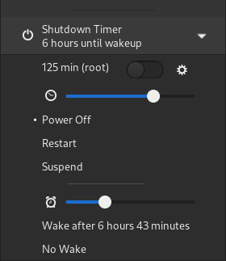

<h1 align="center">Shutdown Timer for Gnome Shell</h1>
<p align="center">
  
  <a href="https://extensions.gnome.org/extension/4372/shutdowntimer/">
    </img>
  </a>
  <a href="https://github.com/Deminder/ShutdownTimer/actions/workflows/build.yml"></img></a>
  <br/>
  <b>Shutdown/reboot/suspend your device after a specific time or wake with a rtc alarm.</b> 
</p>


## Features

- Timer for _Poweroff_, _Reboot_, _Suspend_

  - Options may be reordered or hidden
  - During the unlock-dialog the timer will not stop. (The timer will stop if the extension is disabled or when logging out.)

- Show scheduled shutdown info as _(sys)_

  - Fetched from `/run/systemd/shutdown/scheduled`
  - Externally run `shutdown 100` displayed in menu: <br/>
  - Displays the more urgent (external or interal) timer

- Install privileged control script: `shutdowntimerctl`

  - Control `rtcwake` and `shutdown` as user

- Wake alarm

  - Set a real-time-clock (rtc) alarm which wakes the system after shutdown
  - Wake info from: `/sys/class/rtc/rtc0/wakealarm`
  - Wake info displayed in menu: <br/>
  - Controlling wake alarm requires installation of privileged script
  - Note: for advanced use-cases there are more suitable tools: e.g. [gnome-schedule](https://gitlab.gnome.org/World/gnome-schedule)

- Root shutdown protection

  - Toggle `shutdown ${REQUESTED_MINUTES + 1}` command with shutdown timer (for _Poweroff_ and _Reboot_)
  - Protection against gnome-shell terminating, e.g., when logging out
  - If privileged script is not installed, `shutdown` command is run as user

- Check command
  - Runs a shell command and will only continue shutdown if command succeeds
  - Check command may be canceled

## Manual Installation

Requires `gnome-shell-extensions`:

```(shell)
make install
```

Then a new login is required to restart gnome-shell.

### Tool installation

Manually install privileged script for rtcwake and shutdown with:

```(shell)
sudo ./src/tool/installer.sh --tool-user $USER install
```

## Development

### Debug

Install on a virtual/remote host for debugging:

```(shell)
./scripts/install_on_guest.sh $GUEST_SSH_ADDRESS
```

Install locally with debug output enabled:

```(shell)
make debug-install
```

### Update Translations

Extract transalable text from sources to template file `po/main.pot` and update `.po` files:

```(shell)
./scripts/update-pod.sh
```

### References

- https://gjs.guide/extensions/
- https://gjs.guide/guides/
- https://gjs-docs.gnome.org/
- [D-Bus and Polkit (Introduction)](https://venam.nixers.net/blog/unix/2020/07/06/dbus-polkit.html)
- Forked (June 2021) [neumann-d/ShutdownTimer](https://github.com/neumann-d/ShutdownTimer)
